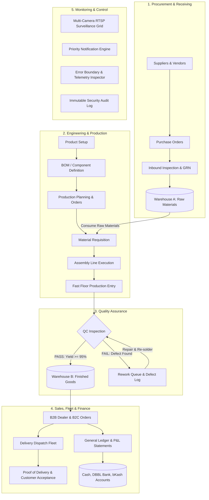
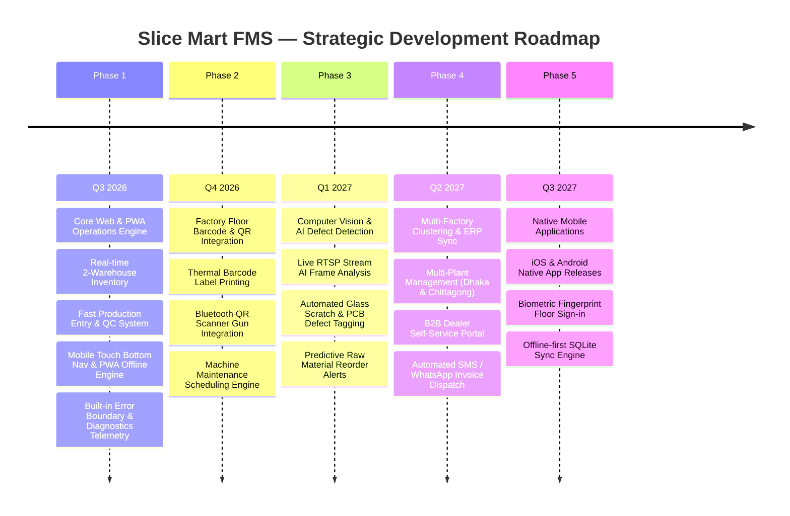

# 🏭 Slice Mart FMS — Factory Management & Business Operations System

## Enterprise Manufacturing, Inventory, 2-Warehouse, QC, Fleet & Financial Command Center

**Engineered by [DevCenterPoint](https://devcenterpoint.com) for Slice Mart Bangladesh**

[](https://react.dev)
[](https://www.typescriptlang.org)
[](https://vitejs.dev)
[](https://tailwindcss.com)
[](https://www.framer.com/motion/)
[](https://zustand-demo.pmnd.rs/)
[](https://web.dev/progressive-web-apps/)

---

## 📋 Repository About / Short Description

> Slice Mart FMS is a production-ready enterprise manufacturing command center for cooker and stove assembly plants in Bangladesh. Built with React 19, TypeScript, Tailwind CSS, Framer Motion & PWA, it manages real-time production lines, 2-warehouse inventory, QC testing, fleet dispatch, shift workforce, and financial ledgers.

---

## 📌 Executive Summary

**Slice Mart** is a leading manufacturing enterprise in Bangladesh specializing in **Infrared Cookers and Stoves**. The factory operates at a throughput scale of **200–250 finished products/day** across **25–30 product models** with single-line assembly, 10+ production workers, a strict Quality Control testing bench, and a dual-warehouse logistics network.

This application is the **production-ready digital operational command center** replacing fragmented Excel sheets and manual paperwork with a unified, real-time, transaction-driven operations platform.

---

## ⚡ Key Highlights & Capabilities

- ⚡ **Instant In-Context Quick Entry Everywhere**: Register new Customers, Onboard Suppliers, add Raw Materials, create Product Models, log new Bank/Cash Accounts, and onboard Shift Workers directly inside operational workflows without ever leaving the page or losing form state.
- 📱 **Fully Responsive Across All Screens**: Desktop, tablet, and mobile-optimized with slide-over drawers, touch targets, and a dedicated mobile bottom navigation bar.
- 🚀 **Progressive Web App (PWA)**: Standalone installation on Windows, macOS, Android, and iOS with full offline caching via Service Worker.
- 🎨 **Industrial-Grade Design System**: Deep Navy (`#0F172A`) palette, controlled electric-blue accents, tabular typography, and smooth micro-animations powered by **Framer Motion**.
- 📊 **Zero Empty Panels**: Every single one of the 40+ operational routes is fully populated with live, reactive business data.
- 🛡️ **Built-in Error Boundary & Diagnostics**: Enterprise crash resilience catching exceptions with stack traces, telemetry logs, and a built-in Error Log Inspector.
- 🔄 **Immutable Transaction Ledger**: Every inventory adjustment, consumption, output, and sales movement maintains a full audit trail.

---

## 🏗️ System Architecture & Workflow



---

## 📦 Complete Module Inventory

### 1. 🎛️ Command Center Dashboard (`/`)

- Real-time factory KPI metrics: Today's Target, Produced Units, QC Pending, Rework Count, Achievement %.
- Multi-timeframe **Production Trend Area Chart** (7-day and 30-day views with gradient fills).
- **Graceful Operational Attention Center**: Real-time critical out-of-stock and low-stock pill cards with one-click direct PO creation.
- **Inventory Health Monitor** with low-stock alerts, out-of-stock badges, and warehouse capacity distribution.
- **Sales & Revenue Snapshot**: Daily sales, monthly revenue, pending deliveries, and due balances.
- **Live Workforce Shift Roster** and top productivity rankings.

### 2. 🏭 Production Suite (`/production/*`)

- **Production Orders (`/production/orders`)**: Batch creation, target tracking, employee assignments, and status pipeline.
- **Production Entry (`/production/entry`)**: High-speed, single-screen touch interface for floor workers to enter daily outputs.
- **Bill of Materials / BOM (`/production/bom`)**: Dynamic product selector, multi-component requirement tables, wastage percentages, and automated unit cost calculation.
- **Production History (`/production/history`)**: Full historical batch archive with yield rates and supervisor sign-offs.

### 3. 📦 Inventory & 2-Warehouse Network (`/inventory/*`, `/warehouse/*`)

- **Warehouse A (`/warehouse/a`)**: 15 raw materials, electrical wire harnesses, PCB boards, bi-metal regulators, heating elements, and glass tops.
- **Warehouse B (`/warehouse/b`)**: Finished cooker and stove models ready for B2B wholesale and B2C dispatch.
- **Stock Movement Ledger (`/inventory/movements`)**: Immutable debit/credit history recording purchases, consumption, outputs, and adjustments.
- **Inter-Warehouse Transfers (`/warehouse/transfers`)**: Formal transfer request, approval, and transit verification workflow.

### 4. 🛒 Procurement & Vendor Management (`/procurement/*`)

- **Supplier Directory (`/procurement/suppliers`)**: Contact profiles, credit limits, payment terms (Net 15/30, COD), and outstanding balances.
- **Purchase Orders (`/procurement/orders`)**: Procurement pipeline with itemized costs, discount handling, and payment tracking.
- **GRN Receiving (`/procurement/receive`)**: Physical receipt verification and Warehouse A stock incrementing.

### 5. 💼 Sales & Fleet Logistics (`/sales/*`, `/delivery/*`)

- **Sales Channels (`/sales/b2b`, `/sales/b2c`, `/sales/raw-material`)**: Segmented sales ledgers with dealer credit management.
- **New Sales Order (`/sales/new`)**: Fast invoice creation with auto-calculated totals, discounts, and inventory validation.
- **Customer Directory (`/sales/customers`)**: B2B dealer vs B2C retail accounts with credit limits and purchase histories.
- **Delivery Fleet (`/delivery`)**: Outbound dispatch board with driver routing, delivery addresses, and proof-of-delivery (POD) tracking.

### 6. 🛡️ Quality Control & Rework (`/qc/*`)

- **QC Queue (`/qc`)**: One-click Pass / Fail testing workflow with failure reason capture and remark logs.
- **Rework Queue (`/qc/rework`)**: Defect remediation queue with technician assignment and re-inspection triggers.
- **QC History (`/qc/history`)**: Historical yield reports, defect trend analysis, and quality compliance logs.

### 7. 👥 Workforce & Shift HR (`/workforce/*`)

- **Employee Directory (`/workforce/employees`)**: Staff cards with salary grades, departments, and shift allocations.
- **Attendance Register (`/workforce/attendance`)**: Daily morning/afternoon shift check-in logs with late/absent flags.
- **Performance Reports (`/workforce/performance`)**: Output-per-worker analytics and incentive calculation benchmarks.

### 8. 💰 Finance & Basic Accounting (`/finance/*`)

- **Chart of Accounts (`/finance/accounts`)**: Real-time balances across Factory Cash, Dutch-Bangla Bank (DBBL), bKash, and Nagad.
- **Transactions (`/finance/transactions`)**: General ledger journal entries with income and expense categorization.
- **Expense Management (`/finance/expenses`)**: Factory utilities, salaries, machine repairs, transport fuel, and rent.
- **Profit & Loss (`/finance/pnl`)**: Monthly revenue vs operational expense breakdown with net margin calculations.

### 9. 📹 Monitoring & CCTV Surveillance (`/notifications`, `/cctv`)

- **CCTV Command Hub (`/cctv`)**: Simulated multi-camera 1080p RTSP live video feeds covering Assembly Lines, WH-A, WH-B, and QC Stations.
- **Priority Notification Center (`/notifications`)**: Critical low-stock warnings, QC failures, payment dues, and shipment alerts.

### 10. ⚙️ Administration & Security (`/admin/*`)

- **User Management & Roles (`/admin/users`, `/admin/roles`)**: Role-based access control (Admin, Factory Manager, QC Inspector, Storekeeper).
- **System Error Log Inspector**: Telemetry modal tracking client-side runtime exceptions with stack traces, user-agent details, and one-click copy.
- **System Audit Trail (`/admin/audit`)**: Timestamped security logs tracking all modifications, approvals, and deletions.

---

## 📱 Mobile & Responsive Experience

| Device Class | Viewport Width | Navigation Mode | Key Features |
| :--- | :--- | :--- | :--- |
| **Desktop / Monitors** | `1024px – 2560px+` | Fixed Left Sidebar (256px / 64px) | Full multi-column data grids, advanced charts |
| **Tablets & Laptops** | `768px – 1023px` | Collapsible Compact Sidebar | Adaptive multi-column cards, touch-scrollable tables |
| **Mobile Phones** | `320px – 767px` | Slide-over Drawer + Bottom Nav Bar | One-thumb access, swipe-away drawers, touch tables |

---

## 🛠️ Technology Stack

| Layer | Technology | Purpose |
| :--- | :--- | :--- |
| **Frontend Core** | React 19 + TypeScript | High-performance, strictly typed UI components |
| **Build & Bundler** | Vite 8 | Sub-second HMR and optimized production bundling |
| **Routing** | React Router v7 | Nested route architecture across 60+ operational routes |
| **Styling & System** | Tailwind CSS v4 + Vanilla CSS Tokens | Design system consistency, HSL/hex tokens, dense enterprise layouts |
| **Animations** | Framer Motion v13 | Route transitions, spring counters, staggered reveals, hover micro-interactions |
| **State Management** | Zustand v5 | Reactive in-memory store for live inventory, notification triggers, and UI state (resets on reload) |
| **Data Visualization** | Recharts v3 | Responsive Area charts, Bar charts, and trend analytics |
| **PWA & Offline** | Service Worker + Web Manifest | Standalone mobile install, asset caching, and offline support |
| **Error Handling** | ErrorBoundary + Inspector | Runtime exception safety, telemetry logging, and diagnostics |
| **Icons** | Lucide React | High-clarity industrial and operational iconography |

---

## 🚀 Getting Started

### Prerequisites

- **Node.js**: v18.0.0 or higher
- **Package Manager**: npm, yarn, or pnpm

### Installation

```bash
# 1. Clone or navigate to the project directory
cd slicemart-fms

# 2. Install all dependencies
npm install

# 3. Start the local development server
npm run dev
```

The application will be running locally at `http://localhost:5173`.

### Production Build & Preview

```bash
# Build optimized production bundle
npm run build

# Preview the production build locally
npm run preview
```

---

## 🗺️ Roadmap for Future Development



### Phase 1: Core Operations Engine (✅ Completed)

- [x] Full operational UI covering Production, Inventory, 2-Warehouse, QC, Sales, Fleet, Workforce, and Finance.
- [x] Framer Motion animation overhaul and data-dense interactive panels.
- [x] Complete mobile responsiveness with Slide-out Drawer and Mobile Bottom Nav.
- [x] Progressive Web App (PWA) manifest and Service Worker offline caching.
- [x] Enterprise Error Boundary with Error Log & Diagnostics Inspector.

### Phase 2: Hardware & Barcode Floor Integration (Q4 2026)

- [ ] Direct integration with Bluetooth/USB 2D Barcode & QR scanners for instant stock lookup.
- [ ] ZPL/ESC-POS thermal printer driver for printing Cooker serial numbers, carton labels, and warranty QR stickers.
- [ ] Scheduled machine maintenance tracking (heating element presses, glass cutting rigs, powder-coating ovens).

### Phase 3: AI-Assisted Quality Inspection & Predictive Planning (Q1 2027)

- [ ] Computer Vision integration on CCTV Camera 04 to automatically inspect glass surface micro-scratches and alignment.
- [ ] Machine Learning predictive demand modeling based on seasonal Bangladeshi cooking appliances trends.
- [ ] Automated supplier purchase trigger when lead times intersect with buffer stock thresholds.

### Phase 4: Multi-Factory Clustering & Dealer Portal (Q2 2027)

- [ ] Support for secondary assembly plants and regional distribution hubs.
- [ ] Dedicated B2B Dealer Portal allowing wholesale distributors to check stock availability and place purchase orders online.
- [ ] Automated SMS & WhatsApp invoice notifications to retail and wholesale clients via local gateway.

### Phase 5: Native Mobile Apps & Offline SQLite Sync (Q3 2027)

- [ ] Native iOS and Android apps with background GPS tracking for delivery drivers.
- [ ] Offline-first SQLite local database synchronization for factory floor zones with intermittent Wi-Fi connectivity.
- [ ] Biometric fingerprint reader integration for instant worker attendance clock-in.

---

## 👥 Credits & Organization

- **Client**: Slice Mart Electronics Ltd. (Dhaka, Bangladesh)
- **Engineering & UI/UX**: [DevCenterPoint](https://devcenterpoint.com)
- **Architecture**: Enterprise Manufacturing & Business Operations System

---

**Built with precision for real industrial manufacturing operations. © 2026 DevCenterPoint. All rights reserved.**
