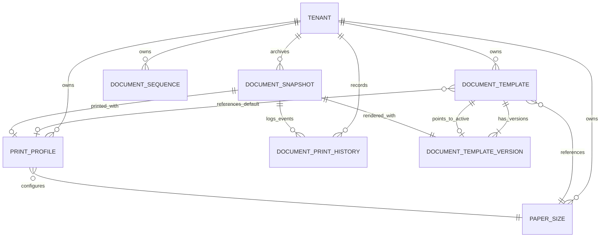

# Centralized Document Template & Printing Architecture
**Document Identifier:** `DOC-ARCH-2026-001`  
**Date:** 2026-08-31  
**Status:** Approved Specification  

---

## 1. Architectural Mission & Core Principle

The Document & Printing infrastructure is a **first-class, tenant-aware platform capability**. It decouples business transactional logic from presentation and layout rules.

### Core Principle
```
DOCUMENT TYPE  +  DOCUMENT DATA  +  TEMPLATE  +  PRINT PROFILE
                              ↓
                   DOCUMENT ENGINE CORE
                              ↓
         ┌────────────────────┼────────────────────┐
         ↓                    ↓                    ↓
  SCREEN PREVIEW        PRINT OUTPUT          PDF OUTPUT
  (Proportional)     (Physical @page)     (Vector Document)
```

No business module (Sales, POS, Purchase, Inventory, Production, Delivery, Finance, HR) is permitted to implement custom print dialogs or raw `window.print()` screen captures. Business modules supply **structured data only**. The Document Engine determines layout, typography, numbering, signatures, and physical output media.

---

## 2. Domain Entities & Database Schema

### 2.1 Entity Relationship Overview



---

### 2.2 Relational Entities Specification

#### 1. `paper_sizes`
Centralized physical paper dimension registry.
- `id` (unsigned big integer, PK)
- `tenant_id` (unsigned big integer, FK to tenants, nullable for global built-ins)
- `uuid` (UUID string)
- `code` (string, e.g. `a4`, `a5`, `a3`, `letter`, `thermal_80`, `thermal_58`, `label_35x25`, `label_50x35`, `custom_barcode`)
- `name` (string, e.g. "ISO A4 Standard (210 × 297 mm)")
- `width_mm` (decimal: 8,2)
- `height_mm` (decimal: 8,2, nullable for continuous thermal roll)
- `unit` (enum: `mm`, `inch`)
- `orientation_default` (enum: `portrait`, `landscape`)
- `is_builtin` (boolean, true for system sizes)
- `is_active` (boolean, default true)
- `created_at`, `updated_at`, `deleted_at`

#### 2. `print_profiles`
Reusable device output configuration.
- `id` (unsigned big integer, PK)
- `tenant_id` (unsigned big integer, FK to tenants)
- `uuid` (UUID string)
- `name` (string, e.g. "Billing Counter A4 Laser", "Dispatch Thermal Roll")
- `paper_size_id` (unsigned big integer, FK to `paper_sizes`)
- `orientation` (enum: `portrait`, `landscape`)
- `margin_top_mm` (decimal: 5,2, default 10.00)
- `margin_bottom_mm` (decimal: 5,2, default 10.00)
- `margin_left_mm` (decimal: 5,2, default 10.00)
- `margin_right_mm` (decimal: 5,2, default 10.00)
- `scale` (decimal: 3,2, default 1.00)
- `copies` (integer, default 1)
- `is_printer_friendly` (boolean, default true)
- `is_default` (boolean, default false)
- `created_at`, `updated_at`, `deleted_at`

#### 3. `document_templates`
Tenant-scoped document templates.
- `id` (unsigned big integer, PK)
- `tenant_id` (unsigned big integer, FK to tenants)
- `uuid` (UUID string)
- `company_id` (unsigned big integer, FK to companies, nullable)
- `branch_id` (unsigned big integer, FK to branches, nullable)
- `document_type` (enum: `sales_invoice`, `delivery_challan`, `purchase_order`, `goods_receipt`, `credit_note`, `debit_note`, `stock_transfer`, `payment_receipt`, `pos_receipt_80mm`, `pos_receipt_58mm`, `barcode_label`, `report`)
- `name` (string, e.g. "Standard Commercial VAT Invoice")
- `paper_size_id` (unsigned big integer, FK to `paper_sizes`)
- `print_profile_id` (unsigned big integer, FK to `print_profiles`, nullable)
- `status` (enum: `active`, `draft`, `archived`)
- `is_default` (boolean, default false)
- `current_version` (integer, default 1)
- `active_version_id` (unsigned big integer, nullable)
- `created_by`, `updated_by`, timestamps, soft deletes

#### 4. `document_template_versions`
Immutable version snapshots.
- `id` (unsigned big integer, PK)
- `tenant_id` (unsigned big integer, FK to tenants)
- `template_id` (unsigned big integer, FK to `document_templates`)
- `version` (integer, e.g. 1, 2, 3)
- `status` (enum: `draft`, `active`, `archived`)
- `change_summary` (string, nullable)
- `layout_config` (JSON structured configuration containing sections, field visibility, column widths, font family, font sizes, margins, signature blocks, terms, colors)
- `created_by` (unsigned big integer, FK to users)
- `created_at`, `updated_at`

#### 5. `document_snapshots`
Permanent snapshot preserving historical document render state upon issuance.
- `id` (unsigned big integer, PK)
- `tenant_id` (unsigned big integer, FK to tenants)
- `uuid` (UUID string)
- `document_type` (string)
- `document_id` (unsigned big integer, polymorphic ID of target record)
- `document_number` (string, e.g. "INV-2026-000042")
- `template_version_id` (unsigned big integer, FK to `document_template_versions`)
- `print_profile_id` (unsigned big integer, nullable)
- `data_payload` (JSON authoritative freeze of document data at issue time)
- `checksum` (SHA-256 hash of payload + layout config)
- `created_at`

#### 6. `document_print_histories`
Append-only reprint and PDF generation audit log.
- `id` (unsigned big integer, PK)
- `tenant_id` (unsigned big integer, FK to tenants)
- `uuid` (UUID string)
- `document_type` (string)
- `document_id` (unsigned big integer)
- `document_number` (string)
- `template_id` (unsigned big integer, FK to `document_templates`)
- `template_version` (integer)
- `print_profile_id` (unsigned big integer, nullable)
- `action` (enum: `print`, `pdf`, `reprint`)
- `copies` (integer, default 1)
- `user_id` (unsigned big integer, FK to users)
- `ip_address` (string, nullable)
- `user_agent` (string, nullable)
- `created_at`

---

## 3. Configuration Hierarchy & Resolution Engine

When a module requests a document render, the `TemplateResolver` navigates the hierarchy:

```
1. Transaction / Explicit Request Override (if permitted)
     ↓
2. Branch Configuration (e.g. Branch #2 thermal slip override)
     ↓
3. Company / Factory Configuration (e.g. Factory #1 delivery challan)
     ↓
4. Tenant Default Template for Document Type
     ↓
5. System Built-in Fallback Template
```

---

## 4. Rendering Pipeline Architecture

```
                 MODULE (e.g. Sales Invoice)
                            │
              Calls useDocumentEngine({ type, data })
                            │
                            ▼
               TEMPLATE RESOLVER SERVICE
         (Checks local cache / API default)
                            │
                            ▼
            DOCUMENT NORMALIZATION & DATA PAYLOAD
  (Injects Company Branding, Currency Symbols, Amount in Words)
                            │
                            ▼
              DOCUMENT ENGINE PORTAL & VIEWPORT
 ┌─────────────────────────────────────────────────────────────┐
 │  PrintPreviewModal                                          │
 │  ├── Top Action Bar (Zoom, Profile Selector, Save PDF, Print)│
 │  └── Viewport Container (Physical Proportional Preview)     │
 │        └── Document Layout Component (e.g. SalesInvoice)    │
 │              └── Evaluates layout_config (columns, signatures)│
 └─────────────────────────────────────────────────────────────┘
                            │
            ┌───────────────┴───────────────┐
            ▼                               ▼
    [Save PDF / Print]                  [Audit Log]
  Mounts to #print-root             POST /api/documents/
  Triggers window.print()           print-history
  with @page layout                 (Records user, copies, action)
```

---

## 5. Security & RBAC Contract

Permissions follow the canonical 3-segment format:
- `documents.template.view` — View list and configuration
- `documents.template.create` — Create new template
- `documents.template.update` — Edit template & create versions
- `documents.template.delete` — Archive template
- `documents.template.manage` — Set defaults & activate versions
- `documents.paper_size.manage` — Manage custom paper sizes
- `documents.print_profile.manage` — Manage print profiles
- `documents.numbering.manage` — Manage sequence prefixes & counters
- `documents.document.print` — Initial print & PDF generation
- `documents.document.reprint` — Reprint historical documents
- `documents.history.view` — View print history audit trail
