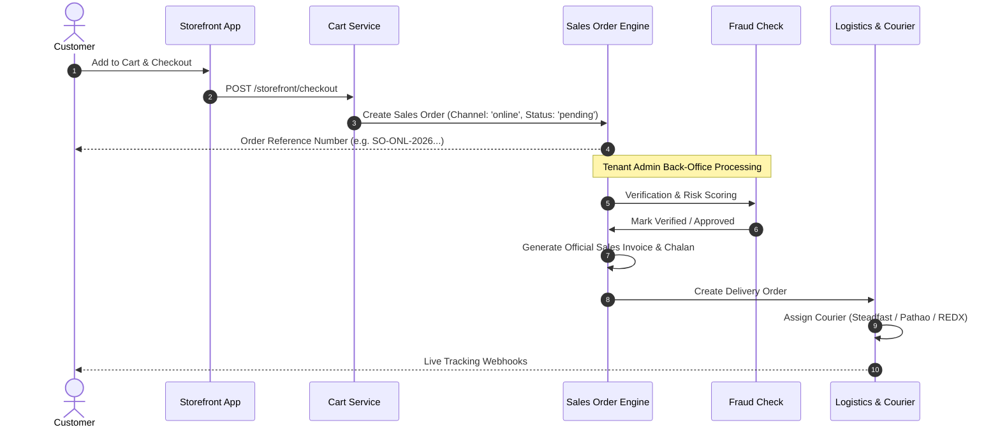

# E-COMMERCE & STOREFRONT ARCHITECTURE
# DevCenterPoint Multi-Tenant Platform

## 1. Domain & Routing Strategy
The e-commerce experience is headless, tenant-isolated, and dynamically rendered:
- **Production URL**: `https://{subdomain}.devcenterpoint.com`
- **Development/Fallback Route**: `http://localhost:5173/store/:subdomain`

### Tenant Resolution Pipeline
1. Incoming HTTP requests are intercepted by `ResolveStorefrontTenant` middleware.
2. Tenant is resolved via:
   - Host header subdomain (e.g. `slicemart.devcenterpoint.com` -> `slicemart`)
   - `X-Storefront-Subdomain` header
   - `X-Tenant-Subdomain` header
3. Once found and validated (`status = 'active'`), `TenantContext::bind($tenant)` establishes tenant isolation for all downstream queries.

---

## 2. Headless API Surface (`/api/v1/storefront/*`)

| Endpoint | Method | Purpose | Authentication |
|---|---|---|---|
| `/storefront/config` | `GET` | Store metadata, branding colors, currencies, policies | Public |
| `/storefront/categories` | `GET` | Active category taxonomy | Public |
| `/storefront/products` | `GET` | Filtered & paginated product catalog | Public |
| `/storefront/products/{idOrSku}` | `GET` | Product detail with variants & stock status | Public |
| `/storefront/cart` | `GET` | Active cart session details & line totals | `X-Cart-Session` |
| `/storefront/cart/items` | `POST` | Add product to cart | `X-Cart-Session` |
| `/storefront/cart/items/{id}` | `PUT` | Update line item quantity | `X-Cart-Session` |
| `/storefront/cart/items/{id}` | `DELETE` | Remove line item | `X-Cart-Session` |
| `/storefront/cart/coupon` | `POST` | Apply discount coupon voucher | `X-Cart-Session` |
| `/storefront/cart/coupon` | `DELETE` | Remove active coupon | `X-Cart-Session` |
| `/storefront/checkout` | `POST` | Convert cart to online order | `X-Cart-Session` |
| `/storefront/orders/track` | `GET` | Public order timeline lookup | Public |
| `/storefront/cms/pages` | `GET` | Dynamic CMS pages & section blocks | Public |
| `/storefront/customer/*` | `*` | Customer registration, login, profile & past orders | Bearer (Customer) |

---

## 3. Order Lifecycle & Separation of Concerns

---

## 4. Storefront CMS & Page Builder Engine
- **Tenant Customization**: Storefronts customize branding colors, hero banner copy, guest checkout toggles, and payment gateways without code changes.
- **Published Catalog Switchboard**: Tenant managers toggle product publication via `POST /api/v1/storefront/products/toggle-publish`.
- **Sandboxed Custom Code Blocks**: Custom HTML/CSS/JS promotional blocks execute exclusively inside sandboxed iframes (`sandbox="allow-scripts"`) on the storefront to prevent tenant code execution inside the management back-office.
- **Voucher Promotion Engine**: Configurable fixed or percentage discounts with minimum order amount requirements.
