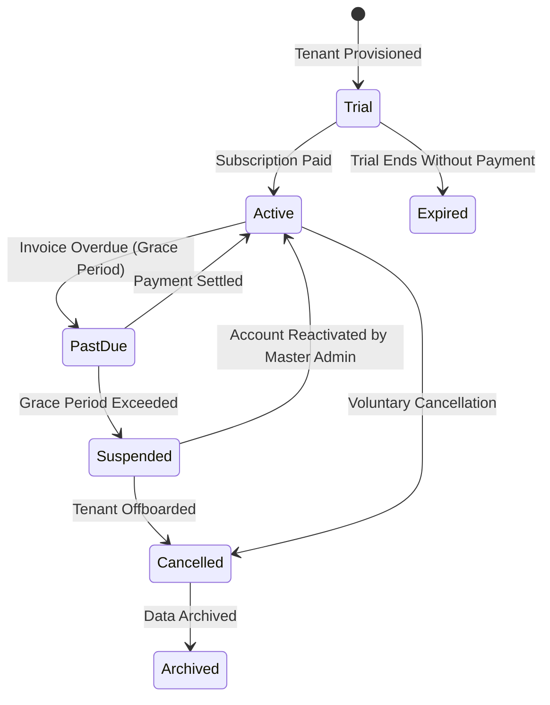

# SAAS ARCHITECTURE

> **Status:** Canonical. Precedence rank 3 (see `DECISIONS.md` §0).
> **Last updated:** 2026-08-28 · **Phase:** Multi-Tenant SaaS Foundation

This document defines the high-level architecture of the **DevCenterPoint Multi-Tenant Factory Management SaaS Platform**.

---

## 1. Architectural Philosophy

DevCenterPoint is a **multi-tenant manufacturing and business operating system**, built as a high-performance **Modular Monolith**.

### The 3 Core Experience Boundaries

```
                    ┌────────────────────────────────────────────────────────┐
                    │                    DEV CENTER POINT                    │
                    │               Platform Operations & Engine             │
                    └───────────────────────────┬────────────────────────────┘
                                                │
         ┌──────────────────────────────────────┼──────────────────────────────────────┐
         ▼                                      ▼                                      ▼
┌─────────────────────────┐            ┌─────────────────────────┐            ┌─────────────────────────┐
│   MASTER SAAS ADMIN     │            │    TENANT MANAGEMENT    │            │   TENANT STOREFRONT     │
│   (/platform/*)         │            │    (/*)                 │            │   ({slug}.domain)       │
├─────────────────────────┤            ├─────────────────────────┤            ├─────────────────────────┤
│ • Tenant Provisioning   │            │ • Factory & Production  │            │ • Public Product Catalog│
│ • Subscription Plans    │            │ • Inventory & Warehouses│            │ • Cart & Checkout       │
│ • Platform Billing & MRR│            │ • Purchasing & POs      │            │ • Customer Portal       │
│ • System Health & Audit │            │ • Sales, POS & Invoicing│            │ • Order Tracking        │
│ • Cross-Tenant Metrics  │            │ • Delivery & Couriers   │            │ • Headless API Bridge   │
│ • Feature Flag Overrides│            │ • HR, Payroll & Finance │            │ • Tenant CMS & SEO      │
└─────────────────────────┘            └─────────────────────────┘            └─────────────────────────┘
```

1. **Master SaaS Admin (`/platform/*`):** Used exclusively by DevCenterPoint platform staff. Manages tenant lifecycles, plans, billing, global health, and platform audit. Never accesses individual tenant business transactions except via audited administrative impersonation.
2. **Tenant Management Application (`/*`):** The operational workspace used by each tenant (e.g. *Slice Mart*, Tenant #1). Houses all factory, inventory, sales, workforce, and financial operations.
3. **Tenant E-Commerce Storefront (`{subdomain}.devcenterpoint.com`):** Public customer storefront delivering branded shopping experiences, cart, checkout, and order tracking.

---

## 2. Tenancy Hierarchy

The platform implements a 7-level structural hierarchy:

```
Platform (DevCenterPoint)
└── Tenant (e.g. Slice Mart - Billing & Hard Isolation Boundary)
    └── Company (Legal entity, distinct tax and registration credentials)
        └── Branch (Commercial unit, retail counter, POS)
            └── Factory (Physical manufacturing site)
                └── Production Line (Machine/station work center)
            └── Warehouse (Stock holding locations, zones, racks, bins)
```

### Hierarchy Rules
- **Tenant is the hard isolation boundary.** Every database query, mutation, report, and export is strictly partitioned by `tenant_id`.
- **Company, Branch, Factory, Line, and Warehouse are scoping boundaries.** A tenant user's permissions and visibility can be scoped to specific nodes via `user_scopes`.
- **Depth is progressive.** A small single-location business sees only what they need; an enterprise tenant utilizes the full tree without structural changes.

---

## 3. Subdomain & Tenant Resolution

### Resolution Chain
1. **Authenticated Requests (Tenant Management):**
   `Authorization: Bearer <JWT>` → `AuthenticateJwt` extracts token → `ResolveTenant` reads authoritative `tenant_id` claim from JWT payload → `TenantContext::bind($tenant, $scopes)` binds request-scoped singleton.
2. **Unauthenticated Public Requests (Storefront & Webhooks):**
   `Host: {subdomain}.devcenterpoint.com` → `ResolveTenantFromHost` parses host prefix → queries `tenants` table by `slug` → binds `TenantContext`.
3. **Platform Requests (Master Admin):**
   `Authorization: Bearer <JWT>` → `AuthenticateJwt` verifies `is_platform_user === 1` and `tenant_id === null` → `EnsurePlatformAdmin` permits access to `/api/v1/platform/*`.

### Reserved Subdomains
The following subdomains are reserved by the platform and cannot be claimed by tenants:
`app`, `admin`, `api`, `platform`, `devcenterpoint`, `mail`, `status`, `portal`, `store`, `shop`, `www`, `localhost`.

---

## 4. Subscription & Plan Lifecycle

### Tenant Status State Machine



### Status Enforcement Matrix
| Tenant Status | Read Access | Write / Mutations | POS & Production | Master Admin Control |
|---|---|---|---|---|
| **`trial`** | ✅ Allowed | ✅ Allowed | ✅ Full Access | Full management |
| **`active`** | ✅ Allowed | ✅ Allowed | ✅ Full Access | Full management |
| **`past_due`** | ✅ Allowed (Read-only) | ❌ Blocked | ❌ Blocked | Status update, grace extension |
| **`suspended`** | ❌ 403 Forbidden | ❌ 403 Forbidden | ❌ Blocked | Reactivate, archive |
| **`cancelled`** | ❌ 403 Forbidden | ❌ 403 Forbidden | ❌ Blocked | Restore, export data |
| **`archived`** | ❌ 403 Forbidden | ❌ 403 Forbidden | ❌ Blocked | Read-only archival |

---

## 5. Security & Isolation Guarantees

1. **Defense in Depth:**
   - Middleware layer: `ResolveTenant` + `EnsureTenantActive` + `EnsurePlatformAdmin`.
   - ORM layer: `BelongsToTenant` trait automatically appends `where('tenant_id', ...)` on every query and auto-populates `tenant_id` on model save.
   - Database layer: `tenant_id` foreign keys, composite primary/unique indices `(tenant_id, code)` on all tenant entities.
2. **Never Trust Client Input:** Client-supplied `tenant_id` parameters in request bodies or query strings are ignored or rejected with a 403 `TENANT_MISMATCH` security violation.
3. **Immutable Platform Audit Trail:** Every tenant creation, status modification, plan upgrade, or administrative override creates an append-only JSON diff record in `audit_logs`.
