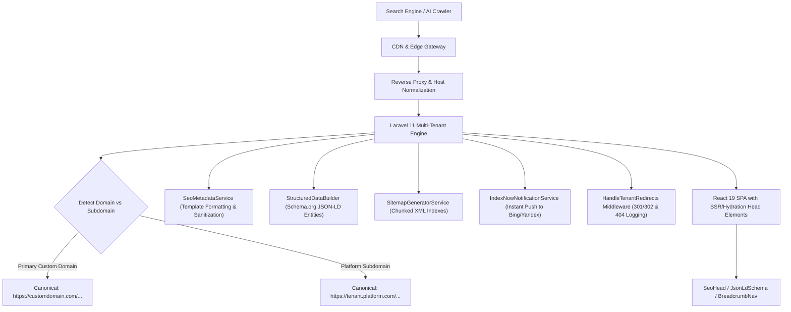

# Platform Discoverability & SEO Architecture

## 1. System Overview
The **Production ERP with Storefront** platform integrates an enterprise-grade, future-proof Discoverability, SEO, GEO (Generative Engine Optimization), and AI Search architecture. It ensures maximum organic discovery across traditional search engines (Google, Bing), AI answer engines (ChatGPT, Perplexity, Claude), shopping discovery networks, and local search ecosystems.



---

## 2. Platform Brand vs. Tenant Brand SEO Separation

| Dimension | Platform Level (DevCenterPoint) | Tenant Storefront Level (e.g. Slice Mart) |
| :--- | :--- | :--- |
| **Domain Scope** | `devcenterpoint.com` / `app.devcenterpoint.com` | `slicemart.tech` or `tenant.slicemart.com` |
| **Target Audience** | B2B Factory Owners, Industrial Enterprises | Retail Customers, Wholesale Buyers |
| **Robots Classification** | Public Landing: `index, follow`<br/>Private Control Plane (`/platform/*`): `noindex, nofollow` | Storefront (`/store/*`, `/products/*`): `index, follow`<br/>Private ERP (`/admin`, `/settings`, `/cart`, `/checkout`): `noindex, nofollow` |
| **Schema Entity** | `SoftwareApplication`, `Corporation` | `Organization`, `LocalBusiness`, `Product`, `Offer` |
| **Isolation Rule** | Platform metrics strictly separated from tenant databases | Multi-tenant tenant_id scoping on all settings, redirects, and sitemaps |

---

## 3. Route Classification Matrix

```
┌────────────────────────────────────────────────────────────────────────┐
│                        ROUTE INDEXABILITY MATRIX                       │
├──────────────────────────────────────┬─────────────────────────────────┤
│          INDEXABLE ROUTES            │        NOINDEX ROUTES           │
│        (index, follow)               │    (noindex, nofollow, noarchive│
├──────────────────────────────────────┼─────────────────────────────────┤
│ • /store/{subdomain} (Homepage)      │ • /store/{subdomain}/checkout   │
│ • /store/{subdomain}/products        │ • /store/{subdomain}/track      │
│ • /store/{subdomain}/products/{slug} │ • /store/{subdomain}/account    │
│ • /store/{subdomain}/collections/*   │ • /platform/* (Control Plane)   │
│ • /store/{subdomain}/pages/{slug}    │ • /settings/* (Tenant ERP)      │
│ • /sitemap.xml (All Sub-Sitemaps)    │ • /catalogue/*, /sales/*, /pos/*│
│ • /robots.txt                        │ • /finance/*, /production/*     │
└──────────────────────────────────────┴─────────────────────────────────┘
```

---

## 4. Multi-Tenant Scoping & Security
1. **Tenant Context Isolation**: Every SEO request resolves tenant identity via `TenantContext` based on host header, `X-Storefront-Subdomain`, or `X-Storefront-Domain`.
2. **Database Integrity**:
   - `tenant_seo_settings`: `tenant_id` unique composite key.
   - `tenant_redirects`: `tenant_id` unique composite index on `(tenant_id, source_path)`.
   - `tenant_not_found_logs`: `tenant_id` composite index on `(tenant_id, path)`.
3. **Data Leak Prevention**: Under no circumstances can Tenant A's sitemaps, structured schemas, redirect rules, or NAP entity data be served to Tenant B.
