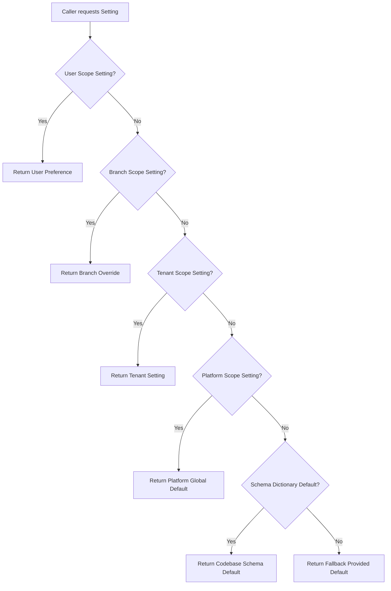
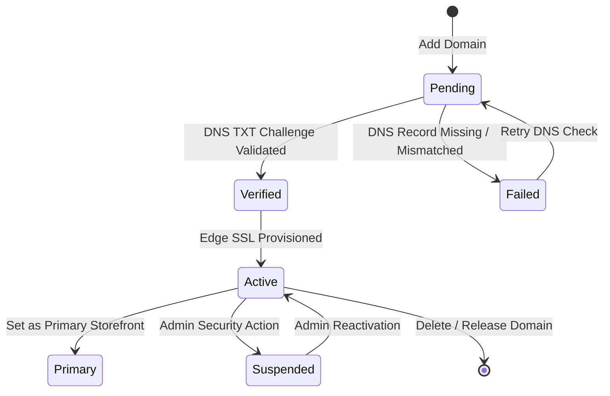

# Settings & Configuration Architecture & Custom Domain System

**Scope**: Tenant Configuration Engine, Inheritance Resolution, Secret Encryption, Multi-Channel Routing, Audit Logging, and Tenant Custom Domain Management.  
**Author**: Engineering Team  
**Status**: Production Ready  

---

## 1. Executive Summary

The Settings & Configuration System is a high-performance, modular platform subsystem designed to eliminate hardcoded constants and enable multi-tenant operational flexibility across 16 core business domains. 

The architecture guarantees:
1. **Hierarchical Inheritance Resolution**: `User Preference` $\rightarrow$ `Branch / Factory Facility` $\rightarrow$ `Tenant Policy` $\rightarrow$ `Platform Default` $\rightarrow$ `Codebase Schema Default`.
2. **Zero-Trust Credential Security**: Third-party API keys, webhook secrets, and payment tokens are encrypted at rest using AES-256-GCM and masked with `••••••••` on API reads.
3. **Immutable Audit Governance**: Every setting mutation is recorded in append-only `audit_logs` tracking actor, IP address, user-agent, before-state, and after-state.
4. **Tenant Custom Storefront Domains**: Relational domain management supporting platform subdomains (`<tenant>.devcenterpoint.com`) and custom primary/alias domains (`slicemart.tech`) with DNS TXT ownership challenge verification (`_dcp-challenge.<domain>`), CNAME routing, and automatic edge SSL.

---

## 2. The 16 Settings Domains

The system organizes all operational configurations into 16 categorized domains defined in `SettingService::getSchemaDictionary()`:

| Category | Domain Key | Title | Scope & Key Parameters |
| :--- | :--- | :--- | :--- |
| **Enterprise Core** | `general` | General & Business Profile | Legal entity name, trade license, TIN/BIN, contact hotline, support email, branding logo/favicon, base currency, formatting, timezone, fiscal year, document numbering prefixes (`invoice_prefix`, `purchase_order_prefix`, `batch_prefix`, `challan_prefix`, `quotation_prefix`, `receipt_prefix`). |
| **Enterprise Core** | `security` | Security & Session Policies | Inactivity timeout (mins), password complexity rules, brute-force lockout, 2FA enforcement for admins, audit trail retention days, maintenance mode toggles. |
| **Enterprise Core** | `notifications` | Notifications & Alerts | Multi-channel dispatch routing (In-App, Email, SMS, WhatsApp) across operational events (low stock, fraud risk, QC batch failure, courier dispatch, material shortage) and promotional SMS quiet hours. |
| **Enterprise Core** | `reports` | Reports & Data Exports | Default export formats (PDF, Excel, CSV), standard paper size (A4, Letter), page orientation, digital timestamp footers, and official company header banner. |
| **Manufacturing & Stock** | `production` | Production & Manufacturing | Work order scheduling policies (`strict_sequential`, `parallel_batch`, `capacity_driven`), material allocation (`fifo`, `fefo`, `lifo`), auto BOM issue, scrap tolerance %, worker piece-rate approval, machine maintenance lock, target output yield %. |
| **Manufacturing & Stock** | `inventory` | Stock & Warehousing | Inventory valuation method (`fifo`, `avco`, `standard`), low stock alert thresholds, negative stock dispatch toggles, batch expiry alert lead days, inter-warehouse signoff gates, and QC quarantine auto-routing. |
| **Manufacturing & Stock** | `qc` | Quality Control (QC) | Sampling standard (`aql_level_ii`, `aql_level_i`, `aql_level_iii`), sampling percentage %, auto-reject on critical defects, dual signoff for rework, and quarantine hold review windows. |
| **Manufacturing & Stock** | `assets` | Fixed Assets & Machinery | Default depreciation method (`straight_line`, `declining_balance`), capitalization threshold amount (৳), preventive maintenance alert cycles, and disposal authorization level. |
| **Procurement & Commercial** | `purchase` | Procurement & Purchases | PO executive approval thresholds (৳), auto-PO generation from reorder points, supplier lead time buffers, PO expiration windows, and 3-way matching enforcement (PO + GRN + Bill). |
| **Procurement & Commercial** | `sales` | Sales & Commercial | Commercial payment terms (`net_30`, `net_15`, `due_on_receipt`), customer credit limit actions (`block_order`, `warn`, `supervisor_pin`), overdue grace days, auto delivery orders, sales return QC, and max commercial discount %. |
| **Procurement & Commercial** | `pos` | Point of Sale (POS) | Default walk-in customer, active payment methods (`cash`, `card`, `bkash`, `nagad`), thermal receipt formats (80mm, 58mm, A4), barcode scanner behavior, manager PIN for voids/discounts, cash drawer variance thresholds, opening cash float prompts. |
| **E-Commerce & Domains** | `ecommerce` | E-Commerce Storefront | Public storefront toggle, guest checkout, COD, digital payments, minimum order amount, free shipping threshold, estimated delivery lead days, 1-tap WhatsApp ordering, automated fraud scoring, catalog items per page, review moderation. |
| **E-Commerce & Domains** | `custom_domains` | Storefront Domains | Dedicated relational domain management for platform subdomains and branded custom domains with DNS verification and edge SSL. |
| **Logistics & Connected APIs** | `delivery` | Delivery & Couriers | Steadfast, Pathao, REDX, Paperfly credentials, sandbox mode toggles, default courier selection, auto-consignment booking, COD charge %, and courier webhook secrets. |
| **Logistics & Connected APIs** | `integrations` | API & Payment Gateways | bKash PGW, Nagad API, SSLCommerz, SMS Gateway credentials (Greenweb, Twilio, BulkSMS BD), WhatsApp Cloud API tokens, Google Tag Manager, GA4, Meta Pixel. |
| **Logistics & Connected APIs** | `finance` | Finance & Accounting | Standard VAT/Sales tax %, auto-posting balanced GL journal vouchers on invoice, unbalanced journal drafts policy, historical depreciation lock, and fractional rounding expense accounts. |
| **Logistics & Connected APIs** | `hr_payroll` | HR & Payroll Configuration | Working days per week, standard work hours, overtime rate multipliers (1.5x, 2.0x), shift attendance grace period, probation duration, monthly salary disbursement target day, and provident fund deduction %. |

---

## 3. Hierarchical Settings Resolution Algorithm

When querying a setting via `SettingService::get($group, $key, $default, $branchId, $userId)`, resolution traverses 5 distinct tiers in order:

### Uniqueness & Sentinel Column Protection
In `settings`, unique constraint enforcement on MySQL 8 and SQLite requires sentinel columns (`tenant_key = coalesce(tenant_id, 0)` and `scope_key = coalesce(scope_id, 0)`) to prevent duplicate platform-default rows when `tenant_id` or `scope_id` is `NULL`.

---

## 4. Tenant Custom Domain & Storefront Resolution

Each tenant storefront is served via:
1. **Platform Subdomain**: `<tenant-slug>.devcenterpoint.com` (automatically created and activated on tenant provisioning).
2. **Primary Custom Domain**: e.g. `slicemart.tech` or `shop.tenantbrand.com`.
3. **Custom Domain Aliases**: e.g. `www.slicemart.tech`.

### Domain Lifecycle & State Machine

### DNS Verification Specification
When a tenant registers a custom domain, the system returns required DNS records:
* **TXT Challenge**: `Host: _dcp-challenge.<domain>` $\rightarrow$ `Value: dcp-verify-<random-token>` (Used to verify domain ownership via authoritative DNS queries).
* **CNAME Record**: `Host: <subdomain|@>` $\rightarrow$ `Target: <tenant-slug>.devcenterpoint.com` (Routes web traffic through the platform edge proxy).
* **A Record Fallback**: `Host: @` $\rightarrow$ `Value: 104.21.45.10` (Apex root routing).

### Server-Side Storefront Resolution Middleware
Incoming HTTP requests pass through `App\Core\Http\Middleware\ResolveStorefrontTenant`:
1. Check `Host` header against verified records in `tenant_domains`.
2. If custom domain matches, bind associated tenant to `TenantContext`.
3. If `<subdomain>.devcenterpoint.com` matches, resolve tenant by subdomain slug.
4. Fall back to `X-Storefront-Subdomain` header for local development and headless API clients.
5. All storefront routing resolves dynamically server-side without relying on untrusted client inputs.

---

## 5. Security & RBAC Policies

* **Master Super Admins (`platform.admin`)**: Access platform-level domain management (`/api/v1/platform/domains`), view all tenant domains, manually verify/suspend domains, and inspect global audit logs.
* **Tenant Admins (`tenant.admin`)**: Access `/api/v1/settings/*` and `/api/v1/storefront/domains`, configure business policies, add/verify custom domains, execute live connection tests.
* **Sensitive Credentials**: Masked in all API responses. Unchanged masked values (`••••••••`) sent in update payloads are safely ignored to prevent accidental credential corruption.
