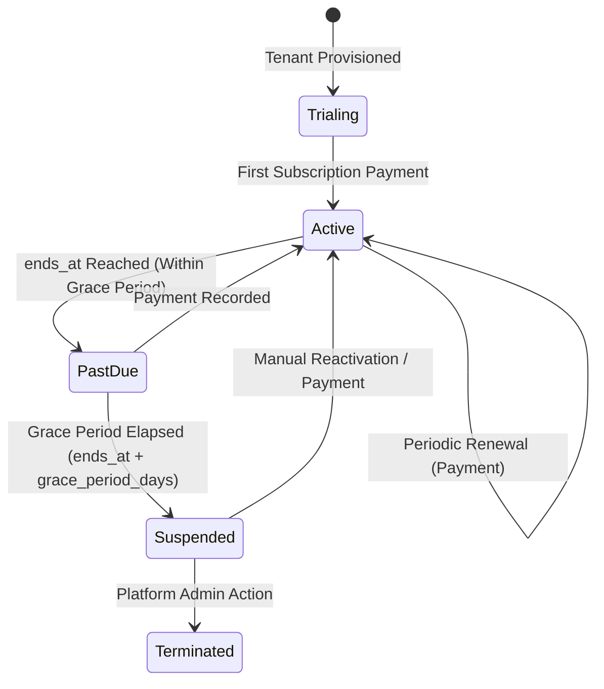

# SaaS Subscription & Cross-Tenant Billing Architecture

This document details the multi-tenant subscription management, cross-tenant payments ledger, currency conventions, and lifecycle state machines governing tenant access in the DevCenterPoint platform.

---

## 1. Core Principles

1. **Default Platform Currency:** The Master SaaS Platform bills in **BDT (৳)** by default. All tenant registration forms and payment records default to `currency_code = 'BDT'`.
2. **Multi-Currency Extensibility:** Every subscription payment record stores an explicit `currency_code` (e.g. `'BDT'`, `'USD'`, `'EUR'`) to support international expansion and multi-currency billing without future schema migrations.
3. **Double Ledger Recording:**
   - Platform subscription payments are recorded at the platform level (`platform_subscription_payments` table).
   - Platform billing is completely isolated from the tenant's internal ERP accounts receivable/payable registers.
4. **Non-Destructive Expiration:** When a tenant's subscription expires, tenant business data is **never deleted**. The system enters a grace period and then switches to `suspended` status, presenting the tenant with a subscription renewal screen upon login.

---

## 2. Subscription Schema & Models

### `tenant_subscriptions` Table
Represents a tenant's billing term agreement:
```sql
CREATE TABLE tenant_subscriptions (
    id BIGSERIAL PRIMARY KEY,
    tenant_id BIGINT NOT NULL REFERENCES tenants(id) ON DELETE CASCADE,
    plan_id BIGINT NOT NULL REFERENCES plans(id),
    status VARCHAR(32) NOT NULL DEFAULT 'active', -- active, past_due, canceled, expired, trailing
    starts_at TIMESTAMPTZ NOT NULL,
    ends_at TIMESTAMPTZ,
    trial_ends_at TIMESTAMPTZ,
    grace_period_days INT NOT NULL DEFAULT 7,
    auto_renew BOOLEAN NOT NULL DEFAULT TRUE,
    last_renewed_at TIMESTAMPTZ,
    renewed_by BIGINT REFERENCES users(id),
    created_at TIMESTAMPTZ,
    updated_at TIMESTAMPTZ
);
```

### `platform_subscription_payments` Table
The immutable SaaS payments ledger for DevCenterPoint:
```sql
CREATE TABLE platform_subscription_payments (
    id BIGSERIAL PRIMARY KEY,
    uuid UUID UNIQUE NOT NULL,
    tenant_id BIGINT NOT NULL REFERENCES tenants(id) ON DELETE CASCADE,
    subscription_id BIGINT REFERENCES tenant_subscriptions(id) ON DELETE SET NULL,
    amount NUMERIC(12,2) NOT NULL,
    currency_code VARCHAR(3) NOT NULL DEFAULT 'BDT',
    payment_method VARCHAR(64) NOT NULL, -- bank_transfer, bKash, nagad, stripe, card, manual_cash
    transaction_reference VARCHAR(128),
    payment_date DATE NOT NULL,
    status VARCHAR(32) NOT NULL DEFAULT 'paid', -- paid, pending, failed, refunded
    notes TEXT,
    recorded_by BIGINT REFERENCES users(id),
    created_at TIMESTAMPTZ,
    updated_at TIMESTAMPTZ
);
```

---

## 3. Subscription State Transitions & Enforcement

The tenant validity status is dynamically determined based on their current term:



### Access Enforcement Rules
- **Active:** Full access to all subscribed plan features.
- **PastDue:** Tenant users receive non-blocking banner notifications warning of pending expiration, but operational access is preserved.
- **Suspended:** Tenant workspace access is blocked with HTTP 403 / `SUBSCRIPTION_SUSPENDED`. The tenant administrator is redirected to the billing renewal portal.
- **Terminated:** Tenant workspace is completely disabled.

---

## 4. Term Management via Master Panel

Platform administrators can extend or modify terms directly from the **Tenant Detail Workspace** (`/platform/tenants/:id`):
1. **Extend Term:**
   - Add relative duration: +7 days, +30 days, +90 days, or +365 days.
   - Or select an exact calendar expiration date.
2. **Grace Period Days:** Custom grace periods per tenant (e.g. enterprise SLAs with 30-day grace windows).
3. **Plan Tier Migration:** Instant upgrade/downgrade between Starter, Growth, and Scale plans.
4. **Recording Payments:** Staff can enter manual payments (bank transfers, bKash, enterprise wire transfers) that automatically append to the ledger and generate audit logs.

---

## 5. Security & Auditing

Every subscription change and payment entry is automatically logged to `audit_logs` without tenant scope:
- `AuditAction::Created`: New subscription payment logged with amount, currency, and transaction reference.
- `AuditAction::Updated`: Subscription term extension, grace period adjustment, or status change.
- Audit records capture the initiating platform staff member ID, IP address, and before/after payloads.
