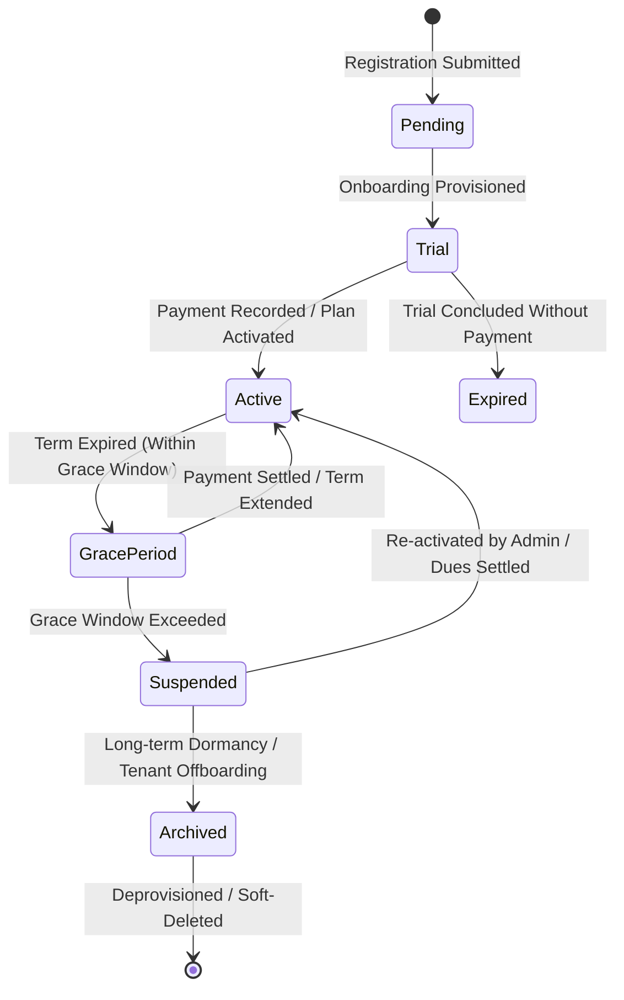

# TENANT LIFECYCLE & SUBSCRIPTION ARCHITECTURE

> **Owner:** DevCenterPoint Platform Architecture  
> **Database Tables:** `tenants`, `tenant_subscriptions`, `platform_subscription_payments`, `tenant_modules`

---

## 1. Tenant Lifecycle State Machine

Each tenant progresses through well-defined lifecycle states:



### State Semantics & Access Permissions

| Lifecycle Status | Tenant Management App (`/*`) | Public Storefront (`/store/:subdomain`) | Platform Control (`/platform/*`) |
|---|---|---|---|
| **`pending`** | Access blocked with "Pending Provisioning" screen | Inactive | Configurable, awaiting activation |
| **`trial`** | Full read/write access up to trial expiration timestamp | Active | Full administrative control |
| **`active`** | Full read/write access under plan limits | Active | Full administrative control |
| **`grace_period`** | Full read/write access with warning banner | Active | Full administrative control |
| **`suspended`** | HTTP 402/423 lockout; read/write intercepted | Maintenance landing page | Full administrative control |
| **`archived`** | Inactive; credentials disabled | Offline | View-only; can restore or purge |

---

## 2. Subscription Validity & Grace Period Engine

Tenant subscriptions are managed through `ManageSubscriptionAction.php` and `TenantSubscription.php`:

### Term Management Operations:
1. **`extend`**: Adds a relative number of days (e.g., +30, +90 days) to the current `ends_at` timestamp.
2. **`set_expiry`**: Sets an exact absolute expiration date (`YYYY-MM-DD`).
3. **`set_grace_period`**: Configures the number of buffer days (`grace_period_days`) a tenant can continue operating past `ends_at`.
4. **`change_plan`**: Switches the plan tier (`Starter`, `Professional`, `Enterprise`), instantly updating tenant quota ceilings (`max_users`, `max_warehouses`, `max_monthly_orders`).

### Effective Status Calculation:
```php
if ($this->status === 'active') {
    if ($this->ends_at && now()->gt($this->ends_at)) {
        $graceEnd = $this->grace_period_ends_at ?? $this->ends_at->addDays($this->grace_period_days ?? 7);
        if (now()->lte($graceEnd)) {
            return 'grace_period';
        }
        return 'expired';
    }
}
```

---

## 3. SaaS Payments Ledger & Multi-Currency Architecture

- **Default Currency:** Bangladeshi Taka (BDT, ৳) as required by platform operational guidelines.
- **Multi-Currency Support:** Each payment record stores an explicit `currency_code` (e.g. `BDT`, `USD`, `EUR`) allowing cross-border tenant billing.
- **Payment Methods Supported:**
  - `bank_transfer`: Electronic Funds Transfer (EFT) / NPSB with transaction reference.
  - `bkash`: Mobile Financial Services merchant settlement.
  - `nagad`: Direct MFS settlement.
  - `stripe`: Online credit/debit card processing.
  - `cash`: Direct physical invoice receipt.
- **Invoice Sequences:** Automated sequential numbering (e.g., `INV-SaaS-2026-0001`) generated per transaction with immutable audit logging.
